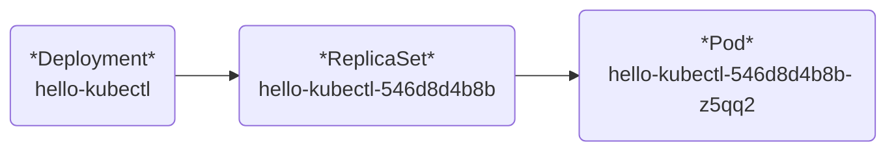

## `NodePort`, `LoadBalancer` 복기하기

### 1. NodePort

* 하나의 **Service Type** 으로서, 클러스터 내부의 Port로 Pod에 접근 할 수 있다.
* NodePort **Service Type** 에 접근하기 위해서, 외부 Port와 클러스터 Port를 매핑시키는 명령 프로세스를 유지해야 한다.

### 2. LoadBalancer

* 프로그램에서 제공되는 **External-Ip**:**Cluster-Ip**로 Pod에 접근 가능 한 **Service Type** 이다.
* LoadBalancer에 연결된 Pod에 접근하기 위해 따로 명령 프로세스를 유지시킬 필요가 없다.
* **External-Ip**는 환경에 따라 다르다.
  * Docker-Desktop, Minikube 와 같은 로컬 테스팅 프로그램 : 127.0.0.1 ==> `localhost`
  * AWS, GCP 와 같은 클라우드 프로그램 : 클라우드 제공 업체마다 다르다. localhost는 아니다.
* NodePort, ClusterIp 기능을 탑재하고 있어 클러스터 내부에서 접근이 가능하다.

---

## `NodePort`, `LoadBalancer` 배포 과정 요약

1. `Pod`을 먼저 선언하지 않고, `Deployment`를 통해 `Pod`을 관리했다.
2. `yaml` 파일을 통해 서비스를 구축하지 않고, `Deployment` 명령어를 통해 서비스를 구축했다.
3. `Pod`의 이름은 `ReplicaSet` 이름으로부터, `ReplicaSet` 이름은 `Deployment`로부터 시작했다.


4. 이는 Deployment를 통해 원하는 상태의 Pod을 조정 할 수 있다는 의미이다.
5. `NodePort`, `LoadBalancer` 서비스 선언을 통해 Deployment로부터 Pod 정보를 가져왔다.

---

## `yaml` 파일 적용을 통한 두 서비스 타입 적용해보기

* 첫 번째로, 명령어 탭에서 직접 밑의 내용을 전부 입력하는 방법 
  * `cat << EOF | kubectl apply -f -` 입력하면 입력 모드 진입
  * `pipe heredoc>` 표시는 입력모드를 의미하며, `EOF` 문자열 입력 전까지 계속 입력 가능.
  * 허나, 문자열 하나 혹은 띄어쓰기가 잘못되었다면, 취소 후 다시 입력해야 함
* 두 번째로, 원하는 에디터에서 `yaml` 작성 후, `kubectl apply -f {만든 파일.yaml}`
  * 쿠버네티스에 적용 할 파일을 담아둘 폴더를 만드세요 - 그게 편해요
  * 

### `NodePort`, `LoadBalancer`에 사용될 - Deployment 생성 과정

```yaml
# 저는 test-echo-deployment.yaml 로 만들었습니다.
# kubectl create deployment echo-server-deployment --image=kicbase/echo-server:1.0
# Deployment 생성 과정

apiVersion: apps/v1
kind: Deployment
metadata:
  name: echo-server-deployment
  labels:
    app: echo-server
spec:
  replicas: 2
  selector:
    matchLabels:
      app: echo-server
  template:
    metadata:
      labels:
        app: echo-server
    spec:
      containers:
        - name: echo-server-container
          image: kicbase/echo-server:1.0
          ports:
            - containerPort: 8080
```
위의 파일이 들어있는 폴더에 들어 간 후, `kubectl apply -f {본인이 작성한 파일.yaml}`

```bash
kubectl apply -f test-echo-deployment.yaml
```
이후, `NodePort`와 `LoadBalancer`에 연결될 **Deployment** 가 만들어집니다.

확인 방법 : 
```bash
kubectl get deployment -l app=echo-server
```

---

### 1. `NodePort` 서비스 적용하기


```yaml
# 저는 파일 이름을 test-echo-nodeport.yaml 로 만들었습니다.
# kubectl expose deployment echo-server-deployment
# Service 생성 과정

apiVersion: v1
kind: Service
metadata:
  name: echo-server-service
  labels:
    app: echo-server
spec:
  type: NodePort
  selector:
    app: echo-server
  ports:
    - port: 8080
      # 이 서비스 입장은 8080이지만, 요청은 targetPort로 바꿀 수 있다. 
      # targetPort를 따로 지정하지 않는다면, 위의 port와 동일하게 설정된다.
      targetPort: 8080
```

NodePort 적용 : 

```bash
kubectl apply -f test-echo-nodeport.yaml
```

`NodePort` 서비스 적용 및 사용 해 보기

```bash
kubectl port-forward svc/echo-server-service 7080:8080
```
```bash
curl http://localhost:7080
```

### 뒷정리

* 프로세스 취소 후, `kubectl delete svc/echo-server-service` 입력

<br>

### 2. `LoadBalancer` 서비스 적용하기

```yaml
apiVersion: v1
kind: Service
metadata:
  name: echo-service-loadbalancer
  labels:
    app: echo-server
spec:
  type: LoadBalancer
  selector:
    app: echo-server
  ports:
    - protocol: TCP
      port: 7080
      # targetPort를 설정하지 않아도 port 선언으로 인해 default로 8080으로 설정됩니다.
      # 꼭 필요하지 않는 옵션이지만, 추후 유연한 서비스 생성을 위해 필수적으로 개념을 알고 있는것이 추천됩니다.
      targetPort: 8080
```
LoadBalancer 적용 : 

```bash
kubectl apply -f test-echo-loadbalancer.yaml
```
`LoadBalancer` 서비스 적용 및 사용 해 보기
```bash
curl http://localhost:7080
```

---

## 다음 포스팅

* `yaml` 파일을 이용한 서비스 적용 중, 사용된 언어에 대한 이해.
* `label` 선언과 **selector**를 이용한 `Pod` 접근에 대해 배울 예정입니다.