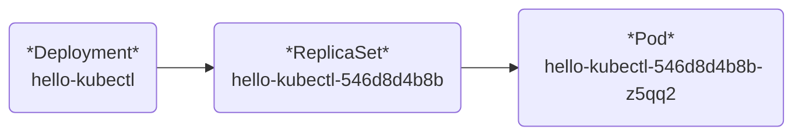

# Kubernetes Ingress 배포하기

---

## `NodePort`, `LoadBalancer` 복기하기

### 1. NodePort

* 하나의 **Service Type** 으로서, 클러스터 내부의 Port로 Pod에 접근 할 수 있다.
* NodePort **Service Type** 에 접근하기 위해서, 외부 Port와 클러스터 Port를 매핑시키는 명령 프로세스를 유지해야 한다.

### 2. LoadBalancer

* 프로그램에서 제공되는 **External-Ip**:**Cluster-Ip**로 Pod에 접근 가능 한 **Service Type** 이다.
* LoadBalancer에 연결된 Pod에 접근하기 위해 따로 명령 프로세스를 유지시킬 필요가 없다.
* **External-Ip**는 환경에 따라 다르다.
  * Docker-Desktop, Minikube 와 같은 로컬 테스팅 프로그램 : 127.0.0.1 ==> `localhost`
  * AWS, GCP 와 같은 클라우드 프로그램 : 클라우드 제공 업체마다 다르다. localhost는 아니다.
* NodePort, ClusterIp 기능을 탑재하고 있어 클러스터 내부에서 접근이 가능하다.

---

## `NodePort`, `LoadBalancer` 배포 과정 요약

1. `Pod`을 먼저 선언하지 않고, `Deployment`를 통해 `Pod`을 관리했다.
2. `yaml` 파일을 통해 서비스를 구축하지 않고, `Deployment` 명령어를 통해 서비스를 구축했다.
3. `Pod`의 이름은 `ReplicaSet` 이름으로부터, `ReplicaSet` 이름은 `Deployment`로부터 시작했다.


4. 이는 Deployment를 통해 원하는 상태의 Pod을 조정 할 수 있다는 의미이다.
5. `NodePort`, `LoadBalancer` 서비스 선언을 통해 Deployment로부터 Pod 정보를 가져왔다.

---

## `yaml` 파일 적용을 통한 두 서비스 타입 적용해보기

### 1. `NodePort`, `LoadBalancer`에 사용될 - Deployment 생성 과정

```yaml
# kubectl create deployment echo-server-deployment --image:kicbase/echo-server:1.0
# Deployment 생성 과정

apiVersion: apps/v1
kind: Deployment
metadata:
  name: echo-server-deployment
  labels:
    app: echo-server
spec:
  replicas: 2
  selector:
    matchLabels:
      app: echo-server
  template:
    metadata:
      labels:
        app: echo-server
    spec:
      containers:
        - name: echo-server-container
          image: kicbase/echo-server:1.0
          ports:
            - containerPort: 8080
```


```yaml
# kubectl expose deployment echo-server-deployment
```