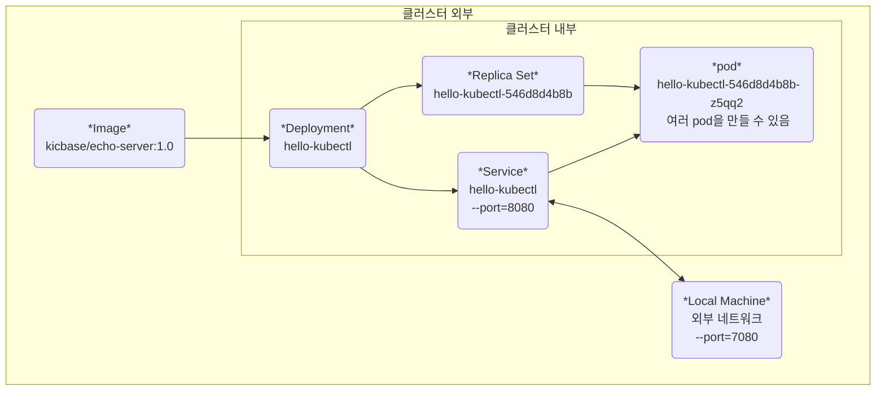

# 어플리케이션 배포하기

[원본 링크](https://minikube.sigs.k8s.io/docs/start/)

---
---

```bash
kubectl create deployment hello-kubectl --image=kicbase/echo-server:1.0
```

* 쿠버네티스는 여러 소스 타입을 가지고 있는데, `deployment`가 해당됩니다.
* 실질적으로 서비스를 적용하기 전에, **hello-kubectl** 라는 이름으로 `deployment`를 생성합니다.
* `deployment`는 버전 관리, 복제(Replica) pod 개수 관리, 자원 할당 관리를 담당 할 수 있습니다.

---

이후, `kubectl`를 통해 **deployment**를 검색할 수 있습니다.
```bash
kubectl get deployment
```
or
```bash
kubectl get deployments
```
**Result** :
```
NAME            READY   UP-TO-DATE   AVAILABLE   AGE
hello-kubectl   1/1     1            1           2m20s
```
* 쿠버네티스를 구성하는 기본 구성 개념 중 가장 중요한 것은 `Pod`입니다.
* 검색된 `deployment` 리스트는 현재 상태에 대해서 보여줍니다.


* **READY** : `deployment`로 부터 탄생된 `Replica` 개수 중 준비가 된 pod의 개수를 보여 줍니다.
* **UP-TO-DATE** : `deployment`는 버전 관리가 가능합니다. 이에 따라, 원하는 구성으로 업데이트가 된 Pod의 수를 의미합니다.
* **AVAILABLE** : 현재 사용자의 요청을 처리 할 수 있는 `Pod`의 수 입니다.
* **AGE** : 이 `deployment`가 만들어 진 후 얼마의 시간이 흘렀는가.

---

```bash
kubectl expose deployment hello-kubectl --type=NodePort --port=8080
```
* hello-kubectl 로 선언된 `deployment`를 **NodePort** 형식의 서비스로 만들었다는 의미입니다.
* `--port=8080`은 클러스터 내부에서 요청을 줄 때, *kicbase/echo-server:1.0* 서버는 8080 포트로 요청받겠다는 의미입니다.

---

service 타입의 리소스도 Kubernetes:k8s의 중요한 자원입니다.

kubectl 명령어로 service를 볼 수 있습니다.

```bash
kubectl get services
```
or
```bash
kubectl get service
```
or
```bash
kubectl get svc
```

**Result** : 
```
NAME            TYPE        CLUSTER-IP      EXTERNAL-IP   PORT(S)          AGE
hello-kubectl   NodePort    10.100.43.224   <none>        8080:32355/TCP   3s
kubernetes      ClusterIP   10.96.0.1       <none>        443/TCP          7d19h
```

* `NAME`, `TYPE`, `CLUSTER-IP`, `EXTERNAL-IP`, `PORT(S)`, `AGE` 컬럼이 존재합니다.


* `NAME` : 현재 만들어진 `service`의 이름
* `TYPE` : 구성된 `Deployment`를 어떤 형식으로 운영(서비스) 하는지에 대한 타입.
* `CLUSTER-IP` : 클러스터 내부에서의 서비스 IP
* `EXTERNAL-IP` : 클러스터 외부에서의 서비스 IP
* `PORT(S)` : 클러스터 내부에서의 Port, 외부에서의 Port, 통신 방법에 대해 나열
* `AGE` : 서비스가 생성 된 지 얼마나 되었는지.

### 추가 설명 (중요)

`NodePort` 타입은 클러스터 외부에서 내부로 접속 할 수 있도록, 클러스터 내부의 하나의 포트를 개방하는 것입니다.

클러스터 외부에서 접속하기 위해서는 `EXTERNAL-IP` + `PORT(S) ㅣ 2번째` 가 결합됩니다.

즉, 로컬 머신에서 `curl http://{EXTERNAL-IP}:32355` 로 요청을 보낼 수 있습니다.

하지만, 클라우드 업체의 로드 밸런서를 쓰고 있지 않기 때문에, `EXTERNAL-IP`는 none(없음)으로 뜹니다.

결과적으로 NodePort 타입으로 8080포트를 선언 한 것은 **hello-kubectl**에 접근하는 2 가지 방법을 줍니다.

1. 클러스터 내부 => `{CLUSTER-IP}:{PORT[0]}` : *10.100.43.224:8080*
2. 클러스터 외부 => `{EXTERNAL-IP}:{PORT[1]}` : *none:32355*

클라우드 제공 업체, ingress를 적용하고 있지는 않기 때문에 곧바로 클러스터 외부에서 내부로 요청을 보낼 수는 없습니다.

따라서, **로컬 머신과 클러스터 내부의 포트 하나씩을 내어주어** hello-kubectl 서비스에 접속 할 수 있도록 합니다.

---

```bash
kubectl port-forward service/hello-kubectl 7080:8080
```
**위 항목의 `service/hello-kubectl`는**
* `service hello-kubectl`
* `svc hello-kubectl` or `svc/hello-kubectl` 
* 와 같습니다.

### 1. `port-forward`

클러스터 외부의 포트와 클러스터 내부의 포트를 연결한다는 의미입니다.

로컬 머신(AWS ec2 와 같은 클라우드 인스턴스 혹은 내 컴퓨터를 의미)의 포트와 

클러스터(kubernetes) 내부의 포트를 연결합니다.

### 2. `service/hello-kubectl`

`kubectl get services` 명령어를 입력 할 때, **hello-kubectl** 이름으로 결과가 나온 서비스를 의미합니다.

### 3. `7080:8080`

현재 로컬 머신으로 사용되는 `localhost:7080` <==> `{CLUSTER-IP:8080}`이 연결됩니다.

로컬 머신의 ip는 `localhost` 즉, `127.0.0.1`을 의미합니다. 

클러스터 내부의 ip(`CLUSTER-IP`}는 프롬프트 결과에 따라 `10.100.43.224`를 의미합니다.

## 요약

로컬 머신인 내 컴퓨터에서 http://localhost:7080 으로 요청을 보내면, 

클러스터 내부에서 hello-kubectl의 ip 주소에 8080으로 요청을 보낸다. http://10.100.43.224:8080

**Result :**
```
kubectl port-forward services/hello-kubectl 7080:8080
Forwarding from 127.0.0.1:7080 -> 8080
Forwarding from [::1]:7080 -> 8080
// 이제 이 탭은 입력을 기다리지 않고 7080포트로 들어오는 요청을 받아들이는 프로세스로 전환되었습니다.
// 새로운 명령을 입력하기 위해서는 새로운 커맨드 탭을 열어야 합니다. cmd + t
```

위의 탭을 끄는 순간 7080:8080 연결이 없어지니 끄지 마시고 새로운 탭을 생성하세요.

새로운 탭에 명령어를 입력합니다.

```bash
curl http://localhost:7080
```
**Result :**
```
Request served by hello-kubectl-546d8d4b8b-z5qq2

HTTP/1.1 GET /

Host: localhost:7080
Accept: */*
User-Agent: curl/8.4.0
```
위와 같이 클러스터 내부의 hello-kubectl 서비스와 응답이 가능한 연결 상태가 된 것을 확인 할 수 있습니다.

웹 사이트에서도 클러스터 내부의 hello-kubectl 서비스에 대한 응답도 볼 수 있습니다.

위의 과정을 거친 후 클릭 [http://localhost:7080](http://localhost:7080)

---

# 사용되었던 리소스를 따로 없애는 법



### 먼저 알아야 할 새로운 내용 

* `Deployment` 로 부터 `Replica Set`이 만들어졌고, `Replica Set`은 `Pod`의 개수를 조정하거나, 업데이트합니다.
* `Replica Set`은 `Deployment`가 원하는 업데이트 복제본이며, 이름은 `Deployment 이름` + `random-string` 이다.
* `Pod`의 이름은 `Replica Set`으로부터 기인하며, `Replica Set 이름` + `random-string`이다.
* `Service`는 `Local Machine`의 요청을 `Pod`에 분배(전달)하는 역할을 한다.

```bash
kubectl scale deployments/hello-kubectl --replicas=4
```
실행 시 hello-kubectl 이름을 가진 pod이 4개가 되는데, 이는 

deployment 명령 -> Replica Set 이 스케일 키움 -> pod 3개 더 생성 이다.

실제로 위의 명령을 확인하기 위해 `kubectl get pods` 를 실행 해 보면,
```
NAME                             READY   STATUS    RESTARTS   AGE
hello-kubectl-546d8d4b8b-8jncb   1/1     Running   0          7s
hello-kubectl-546d8d4b8b-cd572   1/1     Running   0          7s
hello-kubectl-546d8d4b8b-srhlr   1/1     Running   0          7s
hello-kubectl-546d8d4b8b-z5qq2   1/1     Running   0          164m
```

맨 밑의 pod 외 3개의 pod이 새로이 탄생 한 것을 볼 수 있다. (`AGE` 컬럼을 보자.)

따라서, `Deployment`를 삭제하면 자동으로 `Replica Set`과 `Pod`들이 삭제된다.

`Service`를 삭제하면 **NodePort** 타입의 서비스가 삭제되어 **port-forward** 되지 못한다.

`Service` 또한 `Deployment`로부터 기인했으므로, 서비스 제작 과정을 뒤돌아 본다면 `Service` -> `Deployment` 삭제 과정이 올바른 선택이라고 생각한다.

실제 서비스에서는 서로 엮인 리소스가 많을 수 있으므로, 이에 대해 상관관계를 파악 한 후 계획적으로 삭제하는 것이 옳은 판단일 것이다.

## 만든 리소스 삭제하기

1. 먼저 7080 포트를 연결하고 있던 프로세스 탭을 연 후. `cmd + d` 단축키로 세션을 종료한다.
2. `kubectl delete service hello-kubectl` or `kubectl delete svc/hello-kubectl`을 실행한다.
3. `kubectl delete deployment hello-kubectl`을 실행한다.

2, 3번을 통합해서 실행한다면
```bash
kubectl delete svc/hello-kubectl && kubectl delete deployment/hello-kubectl
```
로 명령 할 수 있다.

## Kubernetes(k8s) 종료하기

Docker Desktop 실행과 함께 Kubernetes가 실행되기 때문에,  

Docker Desktop을 종료하면 Kubernetes도 안전하게 종료된다.
