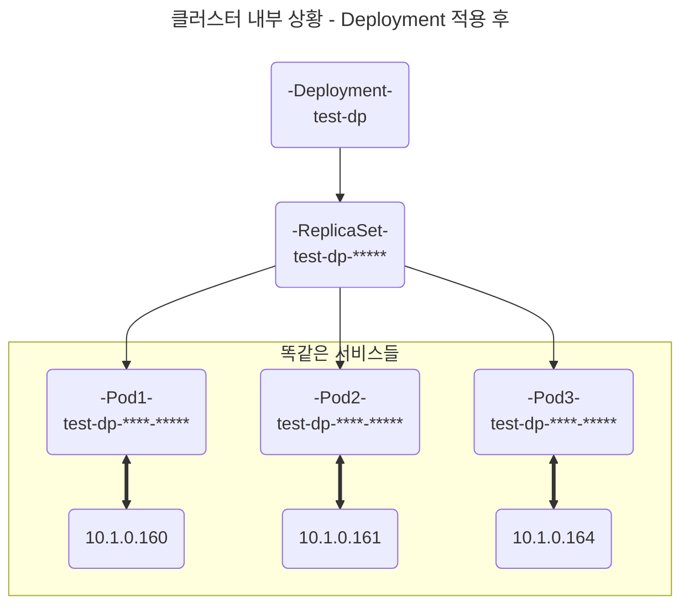
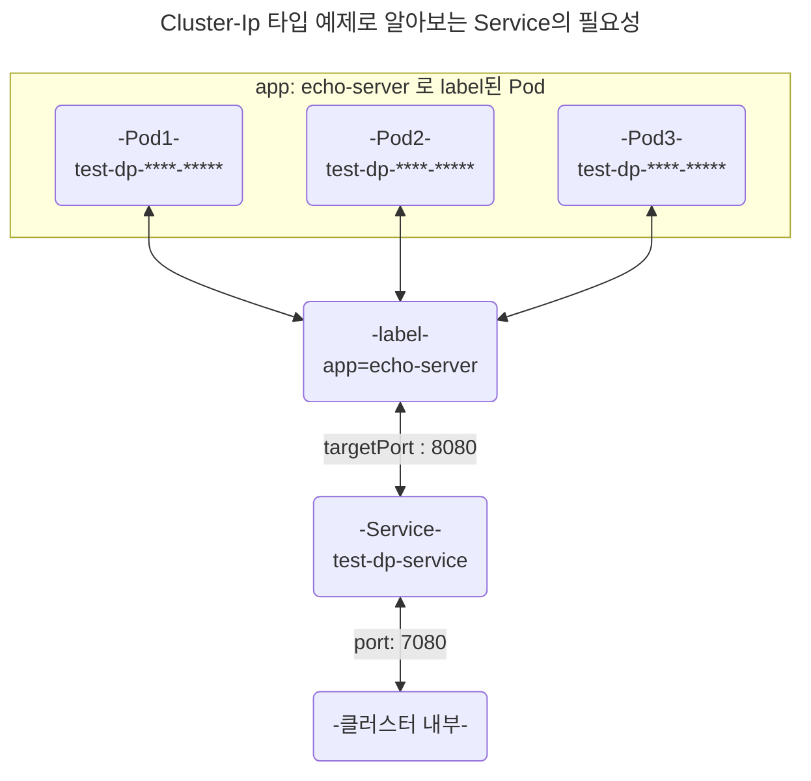

# Yaml 파일과 k8s 변수 개념 익히기

---

## yaml은 무엇일까?

* 프로그램의 구성 내용을 작성하는데 용이합니다.
* 기존의 JSON 방식을 벗어나, 더 좋은 가독성을 제공합니다.
* 선언한 변수에 대해 배열과 집합을 구현 할 수 있습니다.
* 확장자 파일명은 주로 `.yaml` or `.yml`로 귀결됩니다.
* 주석은 `#`으로 시작합니다.
* 하나의 파일에서 또다른 구성 내용을 적용하고자 할 경우, `---`로 구분합니다.

### Example - 변수
```yaml
# 1. 기본변수 선언하기

var1: Hello World!
# .var1 = Hello World!

var2: 
  typing: Let's Typing Yaml File for Studying!
# .var2.type = Let's Typing Yaml File for Stydying!

var3:
  - list1
  - list2
  - list3
# .var3[0] = list1
# .var3[1] = list2
# JSON 표현 시 ==> .var3 = ["list1", "list2", "list3"]

var4:
  - color: Red
    rgb: "e00"
  - color: Green
    rgb: "0e0"
  - color: Blue
    rgb: "00e"
# .var4[0].color = Red
# .var4[1].rgb = 0e0
# Json 표현 시 ==> .var4[2] = {color : "Blue", rgb : "00e"}
```

---

## k8s에 적용되는 Yaml의 변수 개념 익히기

[Kubernetes의 Deployment 공식 문서](https://kubernetes.io/docs/concepts/workloads/controllers/deployment/)

직전 페이지에서 yaml 파일을 만들어 이를 **Deployment**, **Service**를 적용해 보았다.

작성했던 yaml 파일을 예제로 하여 함께 변수의 의미를 알아보도록 하자

```yaml
# kubectl create deployment echo-server-deployment --image=kicbase/echo-server:1.0
# Deployment 생성 과정

apiVersion: apps/v1
kind: Deployment
metadata:
  name: echo-server-deployment
  labels:
    app: echo-server
spec:
  replicas: 2
  selector:
    matchLabels:
      app: echo-server
  template:
    metadata:
      labels:
        app: echo-server
    spec:
      containers:
        - name: echo-server-container
          image: kicbase/echo-server:1.0
          ports:
            - containerPort: 8080
```

`apiVersion`, `kind`, `metadata`, `spec`에 초점을 맞추면 됩니다.

### apiVersion :

* 생성할 리소스 타입이 정의되어 있는 api를 선언합니다.
* 쿠버네티스에서 리소스 유형에 따라 사용되는 API그룹과 버전은 다릅니다.
  * ex - Pod, Service = v1
  * ex - Deployment, ReplicaSet, ... = apps/v1

### kind :

* 생성할 리소스 타입을 의미합니다.
  * ex - Pod, Service, Deployment, ClusterRoleBinding, ...
  * 입력된 리소스에 따라 알맞는 apiVersion을 입력해야 합니다.

### metadata :

* 해당 리소스에 이름을 짓고, 라벨링을 통해 쉽게 검색 할 수 있습니다.
* name, namespace, labels ... 
    * `name`: api 서버에 명령 내려 나오는 리소스의 이름을 정의한다.
    * `namespace`: 단일 클러스터 내부에서 만들어진 리소스를 논리적으로 나눕니다. 
    * ex - 개발, 테스팅, 프로덕션 등...
    * `labels` : |`key`:`value`| 형식으로 작성하여 리소스를 찾기 쉽게 만들며, 파일 내부에서 해당 라벨을 이용해 또다른 명령을 내릴 수 있습니다.

### spec :

* 생성할 리소스 타입에 대해 설명합니다.
* 어떻게 해당 리소스를 구성 할 것인지. - Specification(상세 목록)
* 선언된 리소스 타입에 따라 이후 작성되는 내용은 다릅니다.

### 작성된 spec에 대한 보충 설명

`Deployment`는 생성되었거나, 생성할 `Pod`들에 대해 원하는 상태를 명령할 수 있습니다.

예를 들어, Pod을 업데이트 하기 위해서 `Deployment`를 사용해 끊기지 않게 서비스를 운영할 수 있습니다. - `ex - Rolling Update`

트래픽 혹은 사용량에 따라 서비스를 처리하는 `Pod`의 수를 조정 할 수 있습니다.

위의 운영은 `Deployment`와 생성되며 연결된 `ReplicaSet`을 통해 `Pod`에 명령을 내리는 과정입니다.

`Deployment`는 원하는 상태를 정의하며, `ReplicaSet`은 이를 복제하여 `Pod`을 생성하거나 유지합니다.

### spec 코드를 이해해 보자

```yaml
# 위 코드에서 가져온 Deployment 의 yaml 일부

# Deployment 생성과 함께 ReplicaSet도 생성된다.
# ReplicaSet 에 명령을 내린다고 생각하면 편하다.
spec:
  # 하나의 Pod을 2개로 생성하여 트래픽 및 서비스를 분할한다.
  replicas: 2
  # ReplicaSet이 관리하는 Pod은, app: echo-server 레이블이 존재하는 Pod이다.
  selector:
    matchLabels:
      app: echo-server
      
  # 관리 할 각각의 Pod에 대한 선언.
  template:
    # Pod에 app: echo-server 레이블을 선언한다. - ReplicaSet이 관리할 수 있게.
    metadata:
      labels:
        app: echo-server
        
    # Pod에 대한 상세 (Specification)
    spec:
      # Pod 내부에서 사용될 컨테이너 서비스 선언.
      containers:
        # kicbase/echo-server:1.0 이미지 기반 컨테이너 생성
        - name: echo-server-container
          image: kicbase/echo-server:1.0
          ports:
            # 컨테이너 진입 포트 선언
            - containerPort: 8080
```

`spec`은 사용되는 리소스의 목적에 따라 사용 될 변수가 달라지지만, 많은 부분을 공유한다.

---

[쿠버네티스 Service 리소스 공식 문서](https://kubernetes.io/docs/concepts/services-networking/service/#type-nodeport)

## Service 리소스 타입 Yaml 익히기

* Deployment로 Pod을 생성했지만, Service가 Deployment로 연결되는 것이 아니다.
* Service는 Pod에 선언된 labels를 검색하여, 탐색된 Pod에 트래픽, 요청을 전달한다.
* Deployment로 생성된 Pod은 각각의 IP를 가지고 있는데, 이 Pod은 동일한 labels, 즉 app: echo-server 라는 동일한 label을 가지고 있다.
* Service를 사용해서, app: echo-server 선언 된 Pod을 직접 타게팅합니다.

### Pod이 IP Address를 가지고 있는데, 왜 Service가 필요할까?


<br>

Deployment로 Pod Scale을 3개로 늘리며, 똑같은 서비스가 3개가 되었습니다.

예를 들어, 클라이언트의 요청을 원활히 처리하기 위해 Pod을 늘렸지만, 각기 다른 클러스터 IP를 가지고 있습니다.

똑같은 세 Pod에 트래픽을 고르게 분배하기 위해, Service 타입을 선언하여 쉽게 네트워크를 연결 할 수 있습니다.

서비스 리소스가 트래픽을 고르게 분산 할 Pod을 가져오기 위해, label을 이용합니다.



기본 서비스 타입인 `Cluster-Ip`에서 port:7080, targetPort:8080을 적용했을 때의 그래프입니다.

Pod의 IP를 하나씩 찾아 연결 할 필요가 없으며, Pod에 라벨링 된 key:value 값을 이용하여 쉽게 연결 됩니다.

만약 Deployment에서 5개로 Pod을 Scaling 하더라도, template에 선언된 label로 인해 편하게 Service에 연결 됩니다.

ClusterIp 타입은 클러스터 내부에서만 연결이 가능하지만, 

NodePort, LoadBalancer, Externalname 과 같은 서비스 타입으로

클러스터 외부와도 연결 할 수 있습니다.

---

## NodePort Service Type

```yaml
# kubectl expose deployment echo-server-deployment
# Service 생성 과정

# Service 
apiVersion: v1
kind: Service
metadata:
  name: echo-server-service
  labels:
    app: echo-server
spec:
  type: NodePort
  selector:
    app: echo-server
  ports:
    - port: 7080
      # 이 서비스 입장은 8080이지만, 요청은 targetPort로 바꿀 수 있다. 
      # targetPort를 따로 지정하지 않는다면, 위의 port와 동일하게 설정된다.
      targetPort: 8080
      
      # nodePort는 (30000 ~ 32767)으로 자동으로 배정된다. - 그러지 않게 설정 가능
      # nodePort : 30009
```

위 파일 적용 후,

```bash
kubectl port-forward svc/echo-server-service 6080:7080
```
명령어 적용 시, 명령어 프로세스는 포트를 유지하기 위한 프로세스로 전환 됩니다.


1. `localhost`의 6080 포트와 `svc/echo-server-service`의 7080 포트가 연결 됩니다.

2. `svc/echo-server-service`의 7080 포트로 들어온 데이터는 <br> app:echo-server 라벨링 된 `Pod`에 8080포트로 데이터를 보냅니다.
3. `.spec.type`을 NodePort로 선언하지 않을 시, Default 값 `ClusterIp`로 설정됩니다.

---

## LoadBalancer Service Type

```yaml
apiVersion: v1
kind: Service

# app=echo-server 라벨링 된 서비스 "echo-service-loadbalancer" 생성
metadata:
  name: echo-service-loadbalancer
  labels:
    app: echo-server

# Service 상세
spec:
  # Service Type LoadBalancer 선언
  type: LoadBalancer
  
  # app: echo-server 라벨링 된 Pod에 연결하겠다는 의미
  selector:
    app: echo-server
    
  # 해당 서비스로 들어오는 요청의 프로토콜에 따라 여러 포트로 요청을 전송 할 수 있다.
  ports:
    # http or https 요청에 대해서 한함.
    - protocol: TCP
      port: 7080
      
      # 해당 서비스에서 받은 요청은 Pod의 8080 포트로 요청을 보낸다.
      targetPort: 8080
```

1. 위의 `LoadBalancer` Service 적용 시, 자동으로 External-Ip가 설정되며, <br> {External-Ip}:{Cluster-Port}로 요청을 보낼 수 있다.
2. `NodePort` 서비스와 달리 외부와 연결하기 위해 명령 프로세서를 실행 할 필요가 없다.

---

# 요약

1. 쿠버네티스의 리소스를 적용하기 위해 명령어 외, yaml 파일을 이용하여 적용이 가능하다
2. 적용 할 리소스 타입에 따라 apiVersion이 달라진다.
3. 리소스 타입에 따라 spec 정보에 담기는 변수가 달라진다.
4. 리소스의 역할과 성격을 고려하여 배운다면, spec에 담길 변수를 이해 할 수 있다.