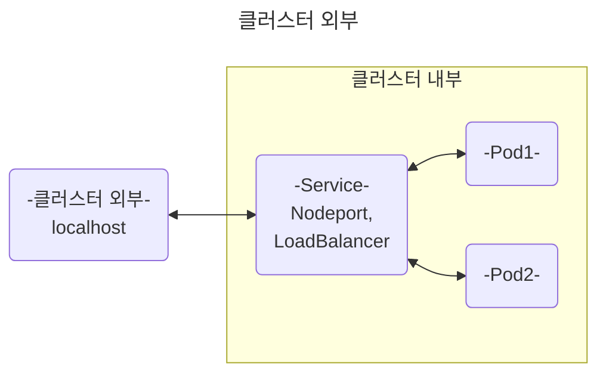
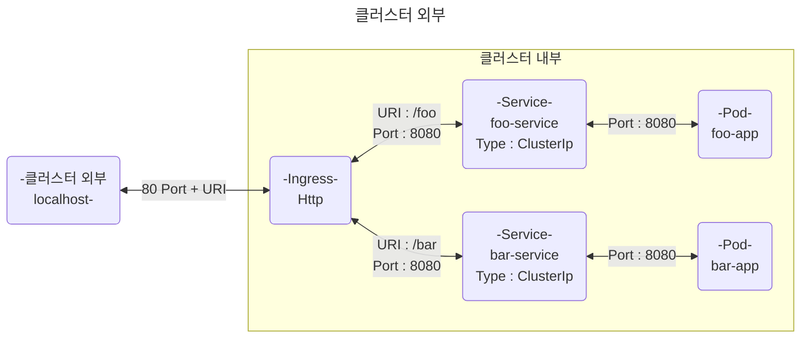

# Ingress 리소스 적용하기

---

## Ingress란 무엇인가?

[쿠버네티스 Ingress 공식문서](https://kubernetes.io/docs/concepts/services-networking/ingress/)

* HTTP or HTTPS를 통해 클러스터 내부 서비스를 클러스터 외부로 노출시킵니다.
* 이전에 다뤘던 NodePort, LoadBalancer는 클러스터 외부 포트와 내부 포트를 연결시키는 데 집중되었습니다.
* Ingress는 이것과 달리, 요청이 들어오는 URL 주소에 따라 다른 서비스에 요청이 들어가게끔 매핑해 줍니다.
* SSL, TLS 인증서를 종료시켜 내부의 요청을 편하게 작성 할 수 있습니다.
* Ingress를 사용하기 위한 사전 준비가 필요하며, 이를 지원하는 많은 오픈소스가 존재합니다.

## Ingress를 사용하기 위한 사전 준비

Minikube의 경우, 쿠버네티스 학습을 위해 addon으로 지원하지만, Docker Desktop은 따로 적용해야 합니다.

URL 라우팅 규칙에 따라 다른 서비스로 로드 밸런싱을 지원하는 Ingress는 오픈소스를 따로 가져와야 합니다.

`nginx`에서 지원하는 Ingress Controller를 가져 올 겁니다.

[nginx Controller Installation guide](https://kubernetes.github.io/ingress-nginx/deploy/)

Nginx-Controller의 Yaml 파일을 가져와서 적용시킵니다.

```bash
kubectl apply -f https://raw.githubusercontent.com/kubernetes/ingress-nginx/controller-v1.10.0/deploy/static/provider/cloud/deploy.yaml
```

**Result :**
```text
namespace/ingress-nginx created
serviceaccount/ingress-nginx created
serviceaccount/ingress-nginx-admission created
role.rbac.authorization.k8s.io/ingress-nginx created
role.rbac.authorization.k8s.io/ingress-nginx-admission created
clusterrole.rbac.authorization.k8s.io/ingress-nginx unchanged
clusterrole.rbac.authorization.k8s.io/ingress-nginx-admission unchanged
rolebinding.rbac.authorization.k8s.io/ingress-nginx created
rolebinding.rbac.authorization.k8s.io/ingress-nginx-admission created
clusterrolebinding.rbac.authorization.k8s.io/ingress-nginx unchanged
clusterrolebinding.rbac.authorization.k8s.io/ingress-nginx-admission unchanged
configmap/ingress-nginx-controller created
service/ingress-nginx-controller created
service/ingress-nginx-controller-admission created
deployment.apps/ingress-nginx-controller created
job.batch/ingress-nginx-admission-create created
job.batch/ingress-nginx-admission-patch created
ingressclass.networking.k8s.io/nginx created
validatingwebhookconfiguration.admissionregistration.k8s.io/ingress-nginx-admission configured
```

Ingress를 활성화 시키기 위해 다양한 Cluster Resource가 적용 된 것을 볼 수 있습니다.

Ingress가 활성화 되었는지 확인하기 위해 Pod을 검색합니다.

```bash
kubectl get pods -n ingress-nginx
```

**Result :**
```text
NAME                                        READY   STATUS      RESTARTS   AGE
ingress-nginx-admission-create-bvmw6        0/1     Completed   0          8m21s
ingress-nginx-admission-patch-lnpmg         0/1     Completed   1          8m21s
ingress-nginx-controller-7dcdbcff84-7qnrs   1/1     Running     0          8m21s
```

또한, Ingress Yaml 파일 적용 시 입력 할 Ingress Class의 이름도 검색합니다.

```bash
kubectl get ingressClass
```

```text
NAME    CONTROLLER             PARAMETERS   AGE
nginx   k8s.io/ingress-nginx   <none>       16m
```

---

## 본격적으로 Ingress 실습 해 보기

* 전엔 Deployment를 통해 Pod을 생성했습니다.
* 생성된 Pod은 동일한 label을 가지고 있었으며, Service가 특정 label Pod에 요청을 보냈습니다.
* 실습을 통해 ClusterIp가 아닌, NodePort or LoadBalancer 서비스 타입을 이용했습니다.

1. Deployment를 통해 Pod을 만들지 않고, 직접 Pod을 만듭니다.
2. Service의 Default Type인 ClusterIp로 Pod에 접근 할 수 있습니다.
3. Ingress에서 URL 매핑 시 Service의 name으로 연결합니다.

## 이전 방식 - Graph



## Ingress 학습 방식 - graph



1. 학습에 사용 될 Pod의 이미지는 `kicbase/echo-server:1.0`입니다.
2. Pod 생성 후, Service를 생성합니다.
3. Service 생성 후, Ingress 작성 및 적용을 통해 URL로 클러스터 내부의 Pod에 요청을 보냅니다.

---

### [적용 할 Ingress Yaml에 대한 내용](https://minikube.sigs.k8s.io/docs/start/)

### 1. foo-app인 Pod, Service 생성하기

```yaml

# Pod 생성
apiVersion: v1
kind: Pod
# pod 검색 시 이름은 foo-app
# 다른 리소스에서 Pod 검색 시 app: foo 레이블로 검색하도록 선언
metadata:
  name: foo-app
  labels:
    app: foo
spec:
  # Pod의 프로그램이 될 컨테이너 선언
  # 이름은 foo-container, 이미지는 에코 서버로 가져온다.
  # kicbase/echo-server:1.0은 8080포트로만 접근할 수 있다. - 8080 포트로만 매핑되어 있음.
  containers:
    - name: foo-container
      image: "kicbase/echo-server:1.0"
---
# foo-app Pod에 연결 할 Service인 foo-service 생성
apiVersion: v1
kind: Service
# Ingress에서 자신을 사용 할 때, name: foo-service로 사용 할 수 있다.
metadata:
  name: foo-service
spec:
  # app: foo로 레이블 된 Pod을 선택한다.
  selector:
    app: foo
  # 이 서비스는 8080포트로 접속 할 수 있다.
  ports:
    - port: 8080
```

위의 과정으로 Ingress에 적용 할 foo-app의 Pod, Service가 생성되었다.

```yaml
kind: Pod
apiVersion: v1
metadata:
  name: bar-app
  labels:
    app: bar
spec:
  containers:
    - name: bar-app
      image: 'kicbase/echo-server:1.0'
---
kind: Service
apiVersion: v1
metadata:
  name: bar-service
spec:
  selector:
    app: bar
  ports:
    - port: 8080
```

위의 yaml을 적용하면, bar-app의 Pod, Service가 생성된다.

이제, Ingress의 Yaml을 적용 해 보자

```yaml
# Ingress를 사용하기 위한 apiVersion 선언.
apiVersion: networking.k8s.io/v1
kind: Ingress
# kubectl get ingress 인그레스 검색 시 나오는 이름
metadata:
  name: example-ingress
# 상세 설명 시작
spec:
  # ingress Controller가 될 ingress Class를 기입해야 한다.
  ingressClassName: nginx
  # Routing 규칙 선언 시작
  rules:
    # http 요청의 경우
    - http:
        paths:
          # /foo/** 요청에 대해 응답하겠다. - Prefix 타입
          - pathType: Prefix
            # /foo 경로로 요청 시
            path: /foo
            backend:
              # 실행 될 서비스
              service:
                # foo-service에 요청 보내기
                name: foo-service
                # foo-service의 8080포트로 보낸다.
                port:
                  number: 8080
          # /bar/** 요청에 대해 응답하겠다. - Prefix
          - pathType: Prefix
            # /bar 경로로 요청 시
            path: /bar
            backend:
              # 실행 될 서비스
              service:
                # bar-service에 요청 보내기
                name: bar-service
                # bar-service의 8080포트로 보낸다.
                port:
                  number: 8080
```

위 내용을 적용하고 난 뒤, 
```bash
curl http://localhost/foo
```
```bash
curl http://localhost/bar
```
로 요청을 보내면, kicbase/echo-server가 응답하는 것을 볼 수 있다.