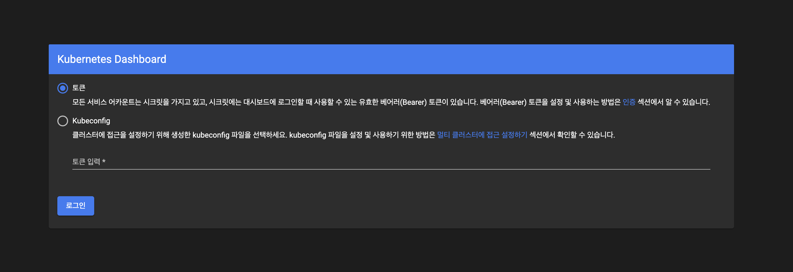
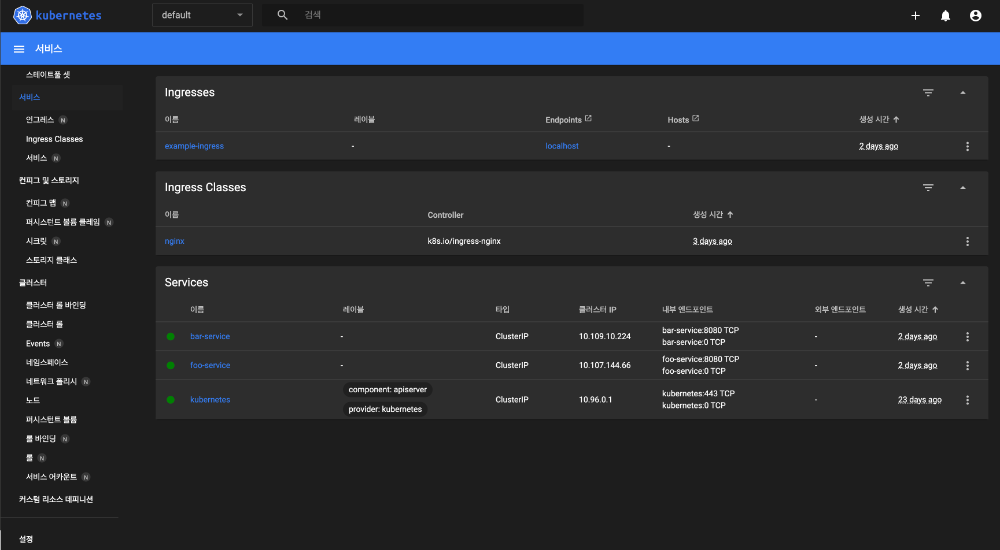
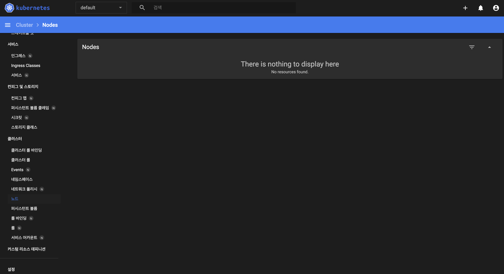

# Dashboard 만들기

---

### 쿠버네티스의 대시보드란?

* 클러스터에서 생성되거나, 만들어진 모든 리소스를 웹 사이트 화면으로 볼 수 있게 해 준다.
* 예제로 만들었던, Pod, Service, Deployment, Ingress .. 등등에 대한 리소스를 UI로 보여준다.
* 해당 UI 웹사이트를 통해 리소스를 조작할 수 있다. - Pod, Service 등등..
* 쿠버네티스에서 공식적으로 배포하는 관리 UI 리소스를 적용 할 예정이다.
* Minikube는 개발 공부를 위해 사용되기에 대시보드가 기본 제공되지만, <br> 실제 쿠버네티스에서는 대시보드 기능이 제공되지 않는다. - 직접 적용해야 함.

---

[쿠버네티스 Dashboard 적용 공식 홈페이지](https://kubernetes.io/ko/docs/tasks/access-application-cluster/web-ui-dashboard/)
 
`공식 홈페이지를 통해 Dashboard를 적용하기 쉽지 않기에, 밑에 쉬운 적용법을 적는다.`

Minikube는 명령어 하나로 모든 리소스를 실시간으로 볼 수 있는 대시보드가 열린다. 하지만, 

실제 쿠버네티스의 경우, 미니큐브와 동일한 대시보드를 가져오기 위해 오픈소스에서 가져와야 하며,

대시보드 오픈소스가 적용 된 namespace에 ServiceAccount를 적용 시켜야 한다.

그 후, 적용 된 유저의 토큰을 발급하고 해당 토큰을 디코딩하여 터미널에 불러와야 한다.

디코딩 된 토큰은 대시보드에 접근하기 위한 비밀번호로 이용된다.

---

## `대시보드 적용하는 법`

* 쿠버네티스에서 배포하는 공식 오픈소스를 적용한다.

```bash
kubectl apply -f https://raw.githubusercontent.com/kubernetes/dashboard/v2.6.0/aio/deploy/recommended.yaml
```
**Result :**
```text
namespace/kubernetes-dashboard created
serviceaccount/kubernetes-dashboard created
service/kubernetes-dashboard created
secret/kubernetes-dashboard-certs created
secret/kubernetes-dashboard-csrf created
secret/kubernetes-dashboard-key-holder created
configmap/kubernetes-dashboard-settings created
role.rbac.authorization.k8s.io/kubernetes-dashboard created
clusterrole.rbac.authorization.k8s.io/kubernetes-dashboard unchanged
rolebinding.rbac.authorization.k8s.io/kubernetes-dashboard created
clusterrolebinding.rbac.authorization.k8s.io/kubernetes-dashboard unchanged
deployment.apps/kubernetes-dashboard created
service/dashboard-metrics-scraper created
deployment.apps/dashboard-metrics-scraper created
```

공식문서에서는 배포한 대시보드를 `proxy` 형식으로 본다.

```bash
kubectl proxy
```

**Result :**

```text
Starting to serve on 127.0.0.1:8001
```
쿠버네티스의 api를 `localhost:8001` 주소에 curl 형식으로 요청할 수 있다.

그리고, 웹 사이트에 밑의 URL을 입력해 보자

[http://localhost:8001/api/v1/namespaces/kubernetes-dashboard/services/https:kubernetes-dashboard:/proxy/](http://localhost:8001/api/v1/namespaces/kubernetes-dashboard/services/https:kubernetes-dashboard:/proxy/)

밑의 사진처럼 모든 리소스를 관장하는 대시보드에 접근하기 위해 보안을 요구한다.



대시보드에 접근하기 위해서는, `cluster-admin` or `admin` 수준의 보안을 가진 서비스 유저를 만들어 토큰을 뽑아내야 한다.

* `cluster-admin` : 대시보드 입장 시 모든 클러스터 리소스에 대한 조정이 가능하다. But, 모든 리소스 조정이 가능 한 만큼, 위험하다.
* `admin` : 대시보드 입장 시 **단일** `namespace`에 존재하는 리소스에 대한 조정이 가능하다. 해당 네임스페이스의 리소스 조정이 가능 한 만큼 위험하다.
* 즉, 전문적으로 리소스를 다룰 수 있는 대시보드를 제작하지 않는 한, 위의 `RBAC` 계정의 존재와 접속은 개발용으로 이용하자.

그리고, `cluster-admin` or `admin` 둘 중 하나에 따라 제공되는 `권한`과 `리소스`가 달라진다.

## 1. cluster-admin 수준의 권한 - k8s 전체 권한

```yaml
# kubernetes-dashboard 네임스페이스에 admin-user 이라는 계정 생성 - 아직 권한설정 x
apiVersion: v1
kind: ServiceAccount
metadata:
  name: admin-user
  namespace: kubernetes-dashboard
---
# 클러스터 내부에서 어떤 권한을 가지는지 명명한 역할을 "ClusterRoleBinding" 이라고 한다.
apiVersion: rbac.authorization.k8s.io/v1
kind: ClusterRoleBinding
metadata:
  # 이러한 역할의 이름을 나중에 네임스페이스 계정에 주입하기 쉽게
  # admin-user 라는 이름으로 생성하는 것이다.
  name: admin-user
# 이 역할을 어디서 참조하고, 참조한 권한들 중 어떤 수준의 권한을 부여 할 것인가?
roleRef:
  apiGroup: rbac.authorization.k8s.io
  # admin-user 라고 권한 역할이 명명된 리소스에 권한을 부여한다. - 말 그대로
  kind: ClusterRole
  # clusterrole 리소스에 존재하는 cluster-admin을 참조하여 admin-user 역할은 
  # 클러스터 전부를 다룰 수 있는 관리자 혹은 루트 수준의 권한을 부여한다.
  name: cluster-admin
  
# 위에서 선언 한 ClusterRoleBinding의 "admin-user"라는 역할을 어디에 부여 할 것인가
subjects:
  # 맨 위에 kubernetes-dashboard에서 선언한 serviceaccount에 클러스터 루트 수준의 권한을 부여한다.
  - kind: ServiceAccount
    name: admin-user
    namespace: kubernetes-dashboard

```

## 2. admin 수준의 권한 - 네임스페이스 관리 권한

우리가 default 네임스페이스에 개발한 모든 리소스를 볼 수 있습니다.

```yaml
apiVersion: v1
kind: ServiceAccount
metadata:
  name: admin-user
  namespace: kubernetes-dashboard
---
apiVersion: rbac.authorization.k8s.io/v1
kind: ClusterRoleBinding
metadata:
  name: admin-user
roleRef:
  apiGroup: rbac.authorization.k8s.io
  kind: ClusterRole
  name: admin
  
subjects:
  - kind: ServiceAccount
    name: admin-user
    namespace: kubernetes-dashboard

```

## 대시보드에 접근하기 위한 시크릿 토큰 생성

```bash
kubectl -n kubernetes-dashboard create token admin-user
```

**Result :** 예시일 뿐입니다.
```text
eyJhbGciOiJSUzI1NiIsImtpZCI6IiJ9.eyJpc3MiOiJrdWJlcm5ldGVzL3NlcnZpY2VhY2NvdW50Iiwia3ViZXJuZXRlcy5pby9zZXJ2aWNlYWNjb3VudC9uYW1lc3BhY2UiOiJrdWJlcm5ldGVzLWRhc2hib2FyZCIsImt1YmVybmV0ZXMuaW8vc2VydmljZWFjY291bnQvc2VjcmV0Lm5hbWUiOiJhZG1pbi11c2VyLXRva2VuLXY1N253Iiwia3ViZXJuZXRlcy5pby9zZXJ2aWNlYWNjb3VudC9zZXJ2aWNlLWFjY291bnQubmFtZSI6ImFkbWluLXVzZXIiLCJrdWJlcm5ldGVzLmlvL3NlcnZpY2VhY2NvdW50L3NlcnZpY2UtYWNjb3VudC51aWQiOiIwMzAzMjQzYy00MDQwLTRhNTgtOGE0Ny04NDllZTliYTc5YzEiLCJzdWIiOiJzeXN0ZW06c2VydmljZWFjY291bnQ6a3ViZXJuZXRlcy1kYXNoYm9hcmQ6YWRtaW4tdXNlciJ9.Z2JrQlitASVwWbc-s6deLRFVk5DWD3P_vjUFXsqVSY10pbjFLG4njoZwh8p3tLxnX_VBsr7_6bwxhWSYChp9hwxznemD5x5HLtjb16kI9Z7yFWLtohzkTwuFbqmQaMoget_nYcQBUC5fDmBHRfFvNKePh_vSSb2h_aYXa8GV5AcfPQpY7r461itme1EXHQJqv-SN-zUnguDguCTjD80pFZ_CmnSE1z9QdMHPB8hoB4V68gtswR1VLa6mSYdgPwCHauuOobojALSaMc3RH7MmFUumAgguhqAkX3Omqd3rJbYOMRuMjhANqd08piDC3aIabINX6gP5-Tuuw2svnV6NYQ
```

발급된 토큰은 따로 저장하여 대시보드 입장을 위해 제출 할 수 있지만, Secret으로 token을 저장하는 방법도 존재합니다.

## Secret 리소스에 admin-user token 저장

```yaml
# 보안 정보 Secret 리소스 생성
apiVersion: v1
kind: Secret
metadata:
  # 해당 리소스의 이름은 admin-user
  name: admin-user
  # kubernetes-dashboard namespace에 속함.
  namespace: kubernetes-dashboard
  # annotaions를 통해 "admin-user" 과 해당 Secret이 연결 되어 있음을 의미한다.
  annotations:
    kubernetes.io/service-account.name: "admin-user"   
# 이 Secret 리소스는 서비스 계정의 토큰을 저장하는 데 사용하겠다.
type: kubernetes.io/service-account-token  
```

## token 발급 방법

```bash
kubectl get secret admin-user -n kubernetes-dashboard -o jsonpath={".data.token"} | base64 -d
```

**Result :** 예시입니다.
```text
eyJhbGciOiJSUzI1NiIsImtpZCI6IiJ9.eyJpc3MiOiJrdWJlcm5ldGVzL3NlcnZpY2VhY2NvdW50Iiwia3ViZXJuZXRlcy5pby9zZXJ2aWNlYWNjb3VudC9uYW1lc3BhY2UiOiJrdWJlcm5ldGVzLWRhc2hib2FyZCIsImt1YmVybmV0ZXMuaW8vc2VydmljZWFjY291bnQvc2VjcmV0Lm5hbWUiOiJhZG1pbi11c2VyLXRva2VuLXY1N253Iiwia3ViZXJuZXRlcy5pby9zZXJ2aWNlYWNjb3VudC9zZXJ2aWNlLWFjY291bnQubmFtZSI6ImFkbWluLXVzZXIiLCJrdWJlcm5ldGVzLmlvL3NlcnZpY2VhY2NvdW50L3NlcnZpY2UtYWNjb3VudC51aWQiOiIwMzAzMjQzYy00MDQwLTRhNTgtOGE0Ny04NDllZTliYTc5YzEiLCJzdWIiOiJzeXN0ZW06c2VydmljZWFjY291bnQ6a3ViZXJuZXRlcy1kYXNoYm9hcmQ6YWRtaW4tdXNlciJ9.Z2JrQlitASVwWbc-s6deLRFVk5DWD3P_vjUFXsqVSY10pbjFLG4njoZwh8p3tLxnX_VBsr7_6bwxhWSYChp9hwxznemD5x5HLtjb16kI9Z7yFWLtohzkTwuFbqmQaMoget_nYcQBUC5fDmBHRfFvNKePh_vSSb2h_aYXa8GV5AcfPQpY7r461itme1EXHQJqv-SN-zUnguDguCTjD80pFZ_CmnSE1z9QdMHPB8hoB4V68gtswR1VLa6mSYdgPwCHauuOobojALSaMc3RH7MmFUumAgguhqAkX3Omqd3rJbYOMRuMjhANqd08piDC3aIabINX6gP5-Tuuw2svnV6NYQ
```

해당 토큰을 복사하여 대시보드 입장 토큰에 넣는다면, 유저의 권한 수준에 따라 다른 리소스를 보여줍니다.

---

### 보안 수준 : cluster-admin



### 보안 수준 : admin



---

### 대시보드를 적용하기 위한 필요 지식

### 1. `ClusterRoleBinding`

### 2. `ServiceAccount`

### 3. `namespace`
